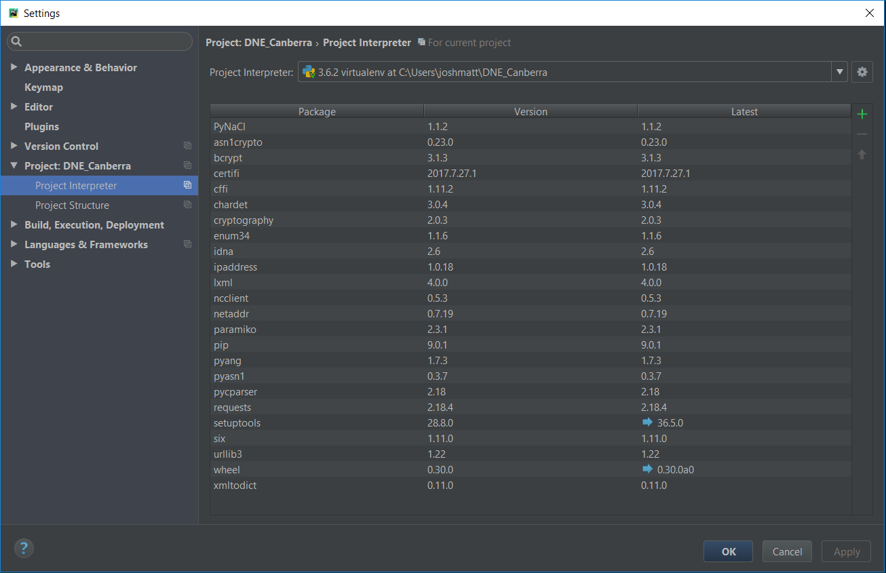
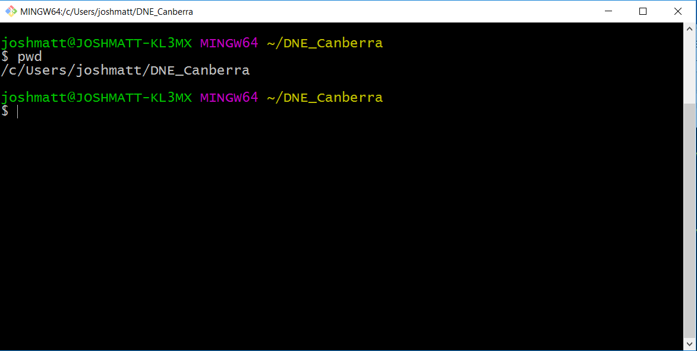
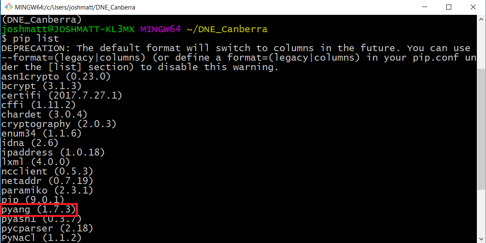
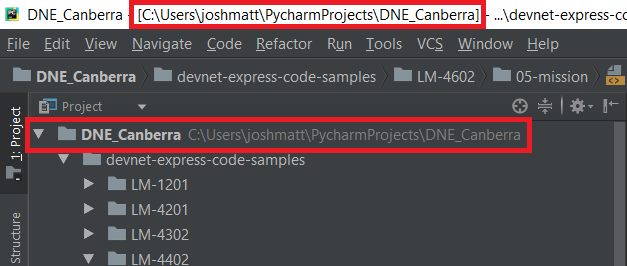
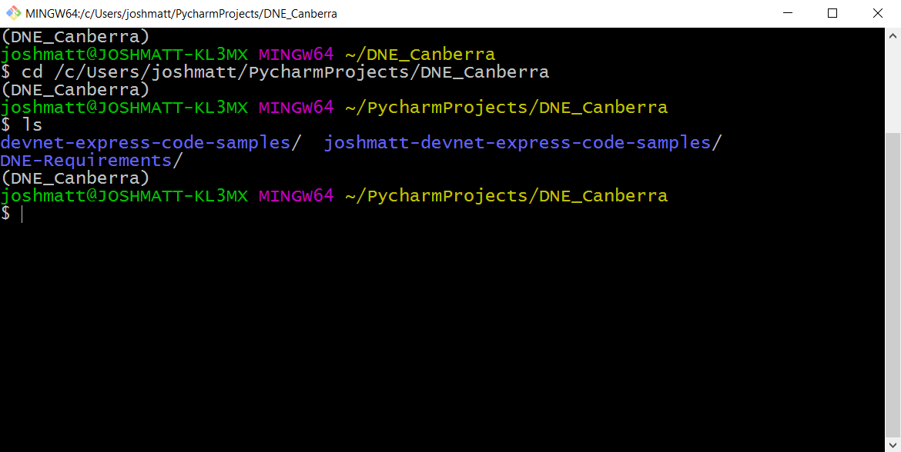
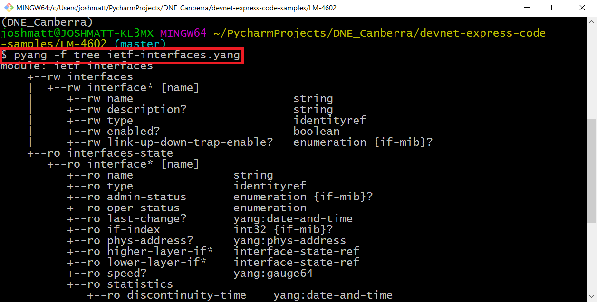

# pyang-for-windows
Running Pyang requires a Bash shell, unless the Windows 10 Creators update is installed - a Bash shell is not installed by default in Windows.
Two fairly simple alternatives exist - Cygwin and Git Bash.
This guide will cover how to find and access your Virtual Environment created in PyCharm, and run Pyang from a Git Bash.

### 1. Find Virtual Environment path from PyCharm
Open `File > Settings...` and expand `Project: <Project_Name>` on the left.
Select `Project Interpreter` underneath.
Take note of the `Project Interpreter` path - this should include the Python version and `virtualenv` before the path.

### 2. Open Git Bash and Activate Virtual Environment
Search for and open the Git Bash from the start menu.

Change directory to the path that was noted above in PyCharm

To activate the virtual environment, from this directory run `source Scripts/activate`

You should now notice the name of your virual environment appear directly above the Git Bash prompt in parenthesis - in my case this was `(DNE_Canberra)`

### 3. Verify and Run Pyang

Confirm that the `pyang` Python package is installed within your virtual environment by running `pip list` from the Git Bash.

If `pyang` was missing, you can install `pyang` by running the command `pip install pyang` from the Git Bash.

Change to your project directory, you can confirm the system path of the project directory in PyCharm.

Change directory to your project directory.

The DevNet Express Netconf/YANG lab example code is found in `devnet-express-code-samples/LM-4602` - change to this directory.

Confirm you can now run `Pyang` from the Git Bash shell by running `pyang -f tree ietf-interfaces.yang`.

